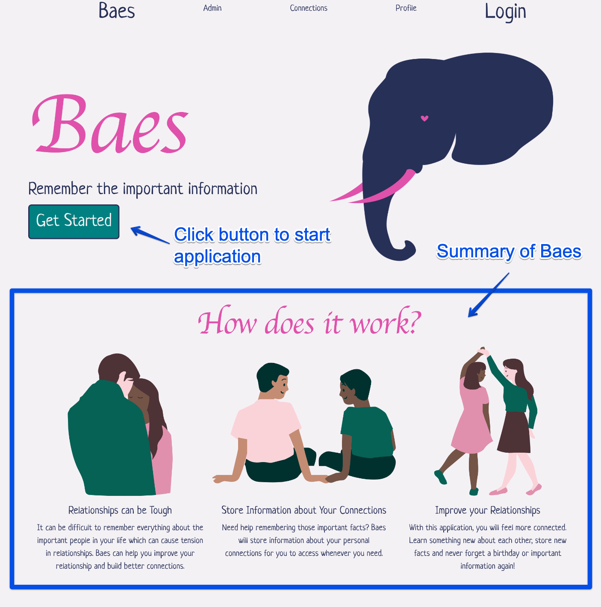
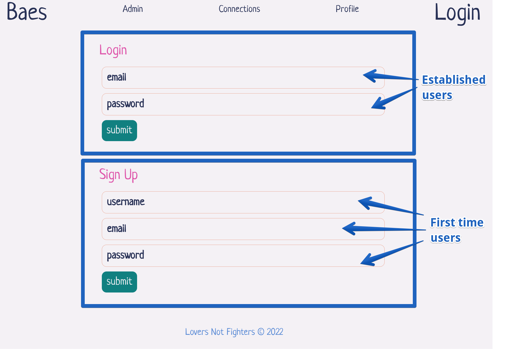
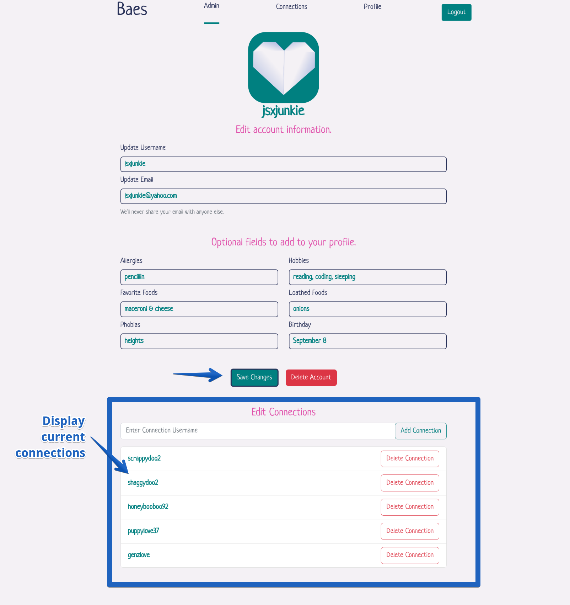
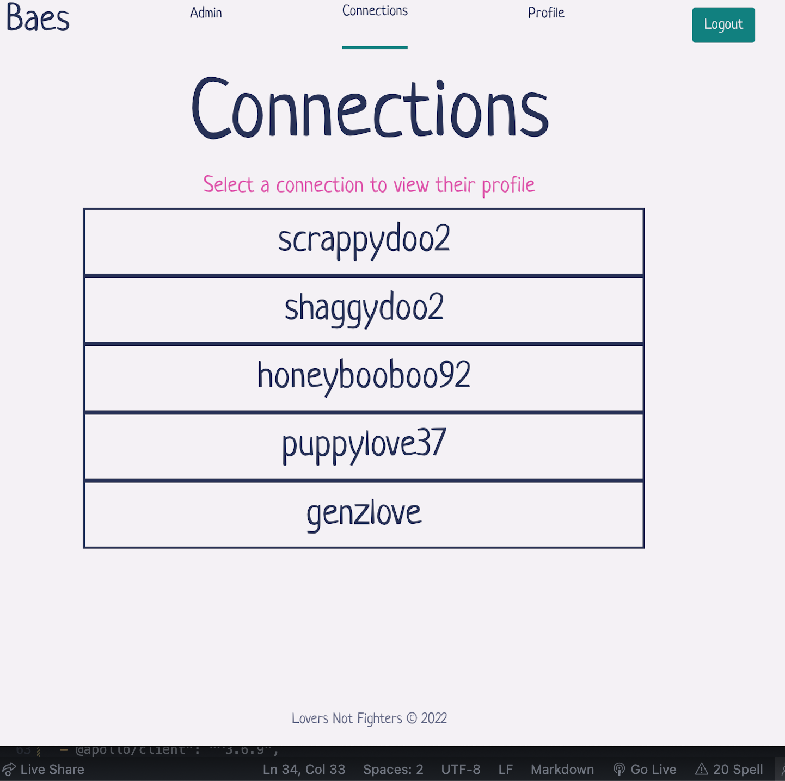
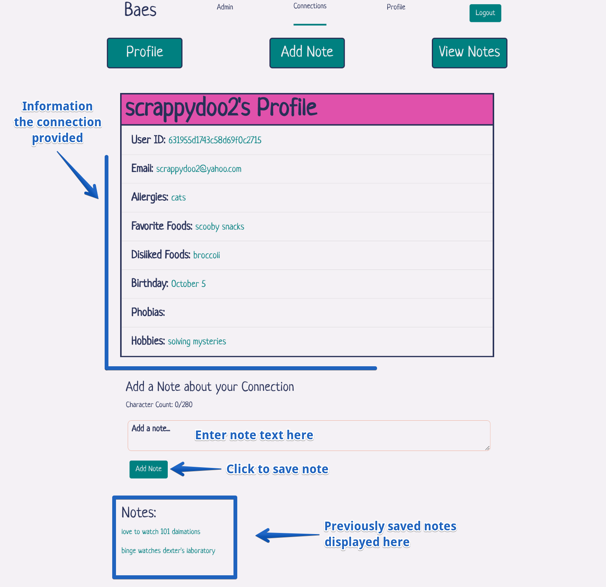
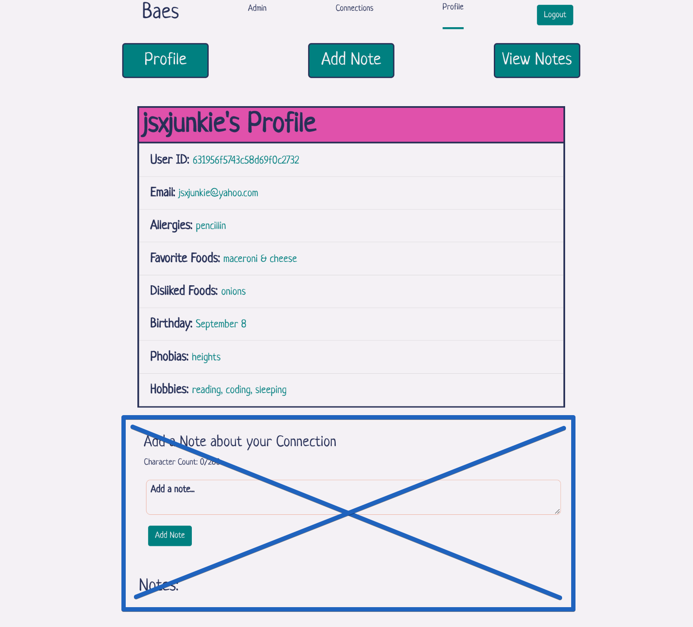
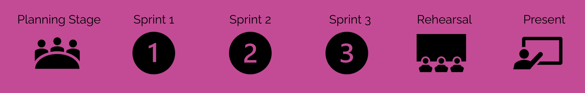
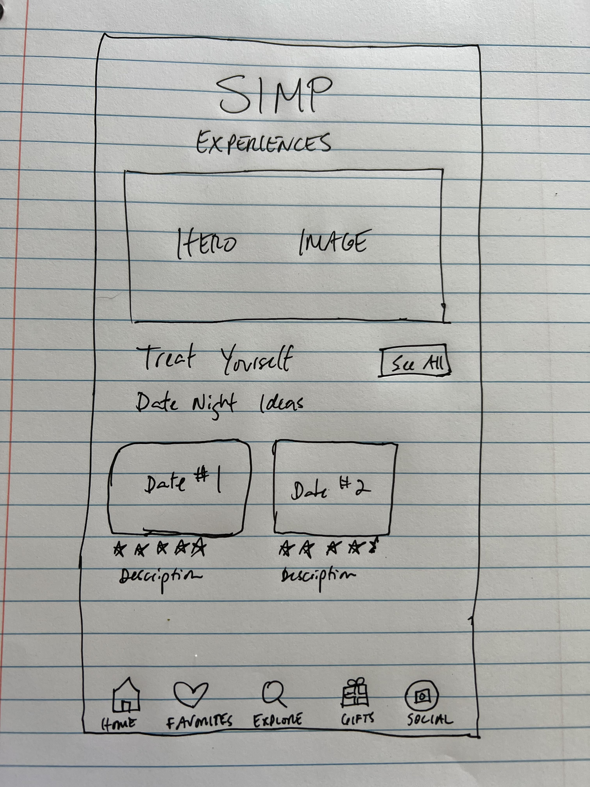
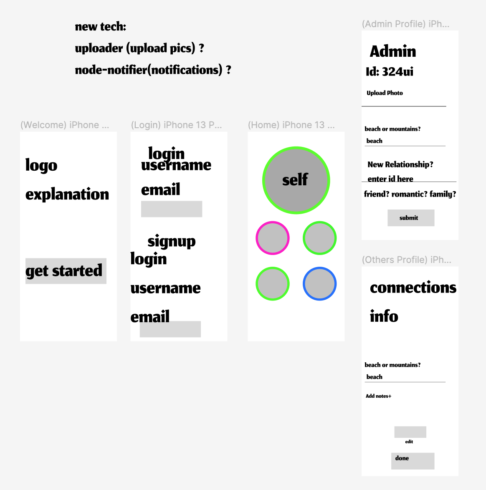

# Baes

## Deployed Link
Click [here](https://loversnotfighters.vercel.app/).

## Description
Full Stack MERN application that allows users to store information pertaining to important relationships. 

## Table of Contents
- [How it Works](#how-it-works)
- [Resources](#resources)
- [Process](#process)
- [Challenges & Solutions](#challenges--solutions)
- [Future Development](#future-development)
- [Wireframes](#wireframes)
- [Contributing](#contributing)
- [Questions](#questions)

## How it Works:
When the user first arrives to Baes, they will be presented with a summary of how the app works and a button to continue with the signup/login process.

User will be prompted to sign in if they are an existing member or sign up if this is the first time using the app. Email, Username and Password are required. Click submit to continue.

First time users will be directed to the Admin page which will display account information. Users can update their username and/or email if they wish. Six optional fields are available to add to a user profile including allergies, hobbies,
favorite foods, loathed foods, phobias and birthday. At this time all fields will be entered as a single string. Click 'Save Changes' if any fields are updated.

To add connections, the user will enter the username of another Baes member and click Add Connection. All connections will be listed underneath with the option to remove connections. 

The Connections link in the navbar will redirect the user to a a page displaying all current connection usernames. Simply click on a usernaeme to view their profile.

Viewing the profile of a connection will display any account information for that user. Fields may be left blank. To add a personal note about that connection, type in the field below and click 'Add Note'. All saved notes will be displayed in chronological order.

To check how your own profile is displayed to others, simply click 'Profile' in the NavBar and you will be directed to your own profile. 

Note: Currently there is an option to add notes about yourself but the functionality does not work. Developers are looking into fixing the issue and would like to remove this section completely from a personal profile.

## Resources:
[Bootstrap](https://www.npmjs.com/package/bootstrap) | [DotEnv](https://www.npmjs.com/package/dotenv) | [Apollo-Server-Express](https://www.npmjs.com/package/apollo-server-express) | [Bcrypt](https://www.npmjs.com/package/bcrypt) | [Express](https://www.npmjs.com/package/express) | [GraphQL](https://www.npmjs.com/package/graphql) | [JSONwebtoken](https://www.npmjs.com/package/jsonwebtoken) | [Mongoose](https://www.npmjs.com/package/mongoose) | [Sass](https://www.npmjs.com/package/sass) | [React](https://www.npmjs.com/package/react) | [React-router-hash-link](https://www.npmjs.com/package/react-router-hash-link) | [@apollo/client](https://www.npmjs.com/package/@apollo/client) | [@emotion/react](https://www.npmjs.com/package/@emotion/react) | [@emotion/styled](https://www.npmjs.com/package/@emotion/styled) | [@mui/icons-material](https://www.npmjs.com/package/@mui/icons-material) | [@mui/material](https://www.npmjs.com/package/@mui/material) | [JWT-Decode](https://www.npmjs.com/search?q=jwt-decode) | [react-dom](https://www.npmjs.com/package/react-dom) | [react-router-dom](https://www.npmjs.com/package/react-router-dom) | [react-scripts](https://www.npmjs.com/package/react-scripts) 

## Process:

## Challenges & Solutions:
- Nested document syntax ->
- Rendering data dynamically ->
- Adding notes to a user ->
- React Hooks ->
- Translating Resolvers to the front end ->
- Centering elements on the page -> className='row justify-content-center' 

## Future Development:
- Allow users to update password
- Make notes editable and deletable
- Incorporate calendar component
- Add reminders for important dates (birthdays, anniversaries, etc)
- Add ability to differentiate the type of connection (romantic, platonic, or familial) to cater to different needs
- Add ability to upload a photo and make that photo the user's profile picture
- Add a question of the day feature to spark conversation between certain connections
- Link wishlists to users to make gifting easier
- For particular connections, suggest activities for both parties
- Add login with Google
- Dynamically render sections of a person's profile page by clicking 'Profile', 'Add Note', and 'View Notes' buttons

## Wireframes:
First Concept:

Second Concept:

## Contributing
<table>
  <tr>
<td align="center"><a href="https://github.com/kyle-david1"> <b>Kyle Baca</b></a></td>
<td align="center"><a href="https://github.com/missatrox44"> <b>Sara Baqla</b></a></td>
<td align="center"><a href="https://github.com/andcooke"> <b>Andrew Cooke</b></a></td>
<td align="center"><a href="https://github.com/BrianLalli"> <b>Brian Lalli</b></a></td>
<td align="center"><a href="https://github.com/chelsea314"> <b>Chelsea Sexton</b></a></td>
 </tr>
</table>

## Questions
Feel free to contact any contributing developer with suggestions for improvements, questions or concerns.
 
[Email: Kyle Baca](mailto:kdbaca5892@gmail.com) 
[Email: Sara Baqla](mailto:missatrox44@gmail.com)  
[Email: Andrew Cooke](mailto:andcooke@duck.com) 
[Email: Brian Lalli](mailto:bdlalli11@gmail.com) 
[Email: Chelsea Sexton](mailto:chelseansexton@gmail.com)

Copyright (c) 2022 Lovers Not Fighters
